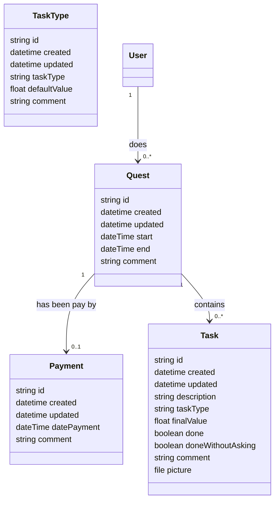

# Clean Quest

React app scaffolded with Vite and Vitest. Uses PocketBase as the backend (required).

## Stack

- React (latest)
- Vite (latest)
- Vitest + Testing Library (JSDOM)

## Scripts

- `npm install` — install deps
- `npm run dev` — start dev server
- `npm run build` — production build
- `npm run preview` — preview build
- `npm test` — run tests in watch mode
- `npm run test:run` — run tests once
- `npm run test:coverage` — coverage report

## PocketBase backend

The gameplay UI (Task Board + HUD) talks to PocketBase via REST when `VITE_POCKETDB_URL` is set. Use the PocketBase admin GUI to manage data (collections are provisioned by the included migration).

Before adding tasks in the app, create at least:
- One Quest (collection: `quests`)
- One Task Type (collection: `task_types`)

Then, in the app’s Task Board, pick the Quest and Task Type and add tasks. Completion updates sync to PocketBase.

Environment variables (`.env` at project root):

```
VITE_POCKETDB_URL=http://127.0.0.1:8090
```

If you serve the frontend on http://localhost:5173, add that origin to PocketBase CORS settings (Admin UI → Settings → CORS).

## Project layout

- `index.html` — Vite entry HTML
- `src/main.jsx` — React bootstrap
- `src/App.jsx` — main shell
- `src/components/TaskBoard.jsx` — gamified task board (PocketBase‑aware)
 - `src/components/GameHUD.jsx` — shows estimated money for current quest
- `src/services/tasks.js` — tasks API (uses PocketBase when configured)
- `src/services/pb.js` — minimal PocketBase REST client
- `src/services/pbData.js` — helpers to list quests and task types
- `src/test/*` — Vitest + Testing Library setup and tests

## Node version

Use Node 18+.

## Docker (PocketBase)

A production multi-stage Dockerfile is included at `Dockerfile` (based on PocketBase docs). It builds the React app with Vite (optionally runs Vitest) and embeds the static files into `/pb/pb_public` inside the PocketBase image.

Build the image (override `PB_VERSION`/`PB_ARCH` if needed):

```
docker build -t clean-quest-pocketbase \
  --build-arg PB_VERSION=0.22.14 \
  --build-arg PB_ARCH=linux_amd64 .
```

Optionally pass Vite envs and skip tests during build:

```
docker build -t clean-quest-pocketbase \
  --build-arg VITE_POCKETDB_URL=http://127.0.0.1:8090 \
  --build-arg SKIP_TESTS=true \
  .
```

Run it, persisting data to `./pb_data` and exposing port 8090:

```
mkdir -p pb_data
docker run --name pocketbase -p 8090:8090 \
  -v "$(pwd)/pb_data:/pb/pb_data" \
  -d clean-quest-pocketbase
```

Point the React app to it by setting in `.env`:

```
VITE_POCKETDB_URL=http://127.0.0.1:8090
```

Then run the frontend dev server:

```
npm run dev
```

Notes:
- `PB_ARCH` values: `linux_amd64` (x86_64), `linux_arm64` (Apple Silicon/ARM).
- The container exposes `/pb/pb_data` as a volume for persistence.
- Healthcheck hits `/api/health` on port 8090.
- The built SPA is served from `/pb/pb_public`. No separate web server is required.

### docker-compose

`docker-compose.yml` is included to run PocketBase and (optionally) a Vite dev server.

- Build and run PocketBase (production image with embedded SPA):

```
docker compose up -d pocketbase
```

- Run Vite dev server alongside PocketBase (hot reload):

```
docker compose --profile dev up web-dev pocketbase
```

You can configure build arguments and Vite envs via a local `.env` file (see `.env.example`). Common variables:

- `PB_VERSION`, `PB_ARCH` — PocketBase binary
- `VITE_POCKETDB_URL` — PocketBase URL the frontend uses
- `VITE_BASE` — Vite base path (defaults to `/`)
- `SKIP_TESTS` — set to `true` to skip Vitest during Docker build
- `UID`, `GID` — host user/group IDs used by services (fixes bind-mount permissions)

If you see PocketBase errors like "permission denied" or "unable to open database file", ensure the bind-mounted data directory is writable by the container user. Either set `UID`/`GID` in `.env` to match your host user, or run:

```
mkdir -p pb_data
sudo chown -R $(id -u):$(id -g) pb_data
```

### Migrations (PocketBase)

PocketBase migration scripts live in `pb_migrations/` and are copied into the image at `/pb/pb_migrations`.

- Apply migrations manually:

```
docker compose run --rm pocketbase migrate up
```

- Rollback last migration:

```
docker compose run --rm pocketbase migrate down
```

The included migration creates collections:
- `task_types` (unique `taskType`, `defaultValue`, `comment`)
- `quests` (`start`, `end`, `comment`, `user`→`users`)
- `tasks` (`description`, `taskType`→`task_types`, `finalValue`, `done`, `doneWithoutAsking`, `comment`, `picture`, `quest`→`quests`)
- `payments` (`datePayment`, `comment`, `quest`→`quests`, unique on `quest`)


# Data model




Voici les règles maintenant que je reprends la gestion de ton argent de poche :

- [Obligatoire] Vaisselle : 5€ à faire une seule fois minimum le WE, à faire avant 15:00. (sauf si absence les deux midis)

- [Obligatoire] Poubelles : 1€ / poubelle (cuisine/compost/2 recyclage/couloir 1er/SDB) 

- [Obligatoire] Linge (sauf Pierre) : 5€ étendre, 1€ ramasser.

- Courses: petite : 2€, grosse: 5€

- 1 seul avertissement, ensuite je le fais à ta place et je déduis le prix de la tâche (je fais les poubelles le lundi matin si pas fait)

- Pas d'avances : tu dois savoir économiser et gérer ton argent, la maison ne fait pas crédit.

- Pas de discussion / de négociation sinon -> 0€.

- 1€ de bonus si tu fais la tâche sans qu'on ait besoin de te demander.

- Amendes: retard au repas: -1€, retard/absence en cours: -2€, insolence: -2€, désobéissance: -1€

- A -50€, blocage du téléphone

- A -100€, plus de sortie

- Réévaluation éventuelle (suivant attitude et inflation) deux fois par an fin juin et fin décembre.

- Le paiement ne se fait que deux fois par mois le dimanche.

- Bingo : +5€ si tu repond à un mail surpirse une fois par mois (peut arriver n'importe quand).

- Rangement chambre: de 0 à 5€ tous les 2 semaines.


rm -rf pb_data && mkdir pb_data && sudo chown -R $(id -u):$(id -g) pb_data

docker compose --profile dev up
